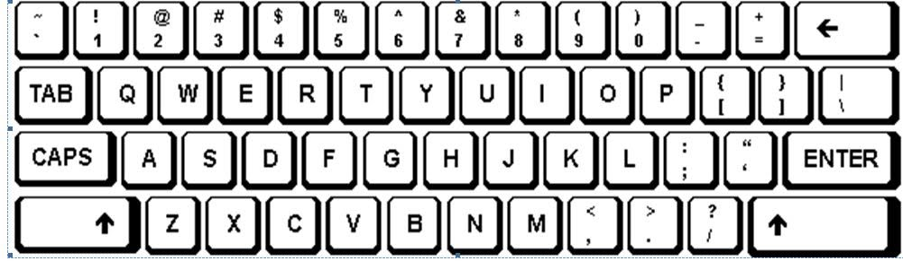

# About me 

Hello world 👋. I'm Ajaypal Singh,studying at MITT Winnipeg. Started with printing `Hello World` n' now trying to dive deep in the game of codes....

 I'm a passionate developer, learning to create fully functional websites and softwares. Feel free to browse my repositories and give your valuable feedbacks .If you have any query or concern, I am always online on [E-mail](mailto:ajeypals7@gmail.com)......

I have programming experience in JavaScript, Node JS, HTML, CSS, React JS. Do you wanna know more?

# My skills

##

# My stats

